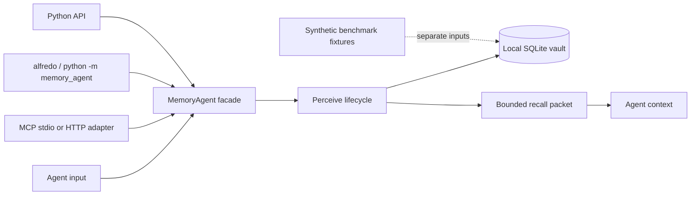

# MemoryAgent architecture

MemoryAgent is a local-first Python SDK and CLI. Its durable boundary is a SQLite vault owned by the caller. The package does not require a hosted backend, tenant service, or remote memory API. MCP and optional LLM integrations are adapters around the same facade; they do not replace the local lifecycle.

## Boundaries and data flow

The CLI, Python API, and MCP tools all pass through `MemoryAgent`. The facade owns namespace selection and lifecycle ordering. `MemoryStore`, embedding, retrieval, and trust behavior are replaceable through ports, but an adapter must preserve the lifecycle rather than implement a second memory loop.

SQLite is local-first: `MemoryStore` persists memories, sessions, embeddings, namespace, metadata, and archive state in the configured database. `MemoryAgent(db_path=...)` selects a vault explicitly; the CLI can select one with `--db`; the MCP adapter resolves `MEMORY_AGENT_DB` or its local default. Filesystem access, backups, permissions, and process isolation remain deployment responsibilities.

## Real lifecycle

One `perceive(...)` call performs the following **perceive turn stages** in this implementation order. Context packing is a conceptual stage in the same turn, not a separate persistence transaction:

1. **Perceive / session scope** — accept input, optional response, and an explicit `namespace`/`user_id`; update session state without treating a namespace as a wildcard.
2. **Extract and consolidate** — check for an explicit forget query first and archive matching records in the active namespace. Then extract candidate preferences, facts, and habits, validate their shape, and consolidate them. A matching or contradictory candidate can **supersede** an older record here; the old record is archived, while an accepted new candidate is stored and indexed in SQLite before retrieval.
3. **Retrieve** — search active records in the active namespace using the configured embedding and ranking signals (semantic score, recency, importance, strength, and diversity).
4. **Validate / trust** — evaluate each retrieved candidate through the trust policy and attach confidence classification, evidence, and a reason. Unknown or untrusted records can be omitted before they enter context.
5. **Pack context (conceptual)** — `ContextBudgetPacker` applies the bounded context budget to trusted results. Its `RecallPacket` exposes `selected_ids`, `dropped_ids`, omitted records, reasons, and accounting rather than copying the vault into a prompt; this is an in-memory representation for the current turn.
6. **Reinforce** — selected memories receive a strength boost and are updated in the same namespace.
7. **Store the interaction** — when the input/response meets the remember policy, store an episodic interaction summary and link it to the active session.
8. **Decay / archive** — at the configured interval, apply the forgetting curve to active strengths and archive records below the archival threshold. An explicit `forget_memory`/`memory__forget` operation archives one record immediately and is separate from time-based decay.

The store commits the turn after these decisions complete. The returned dictionary contains `recollections`, `recollection_text`, `recall_packet`, `evidence`, consolidation decisions, archive counts, and a `lifecycle` object with namespace and decay/archive status. Search and MCP responses similarly expose evidence and selected/dropped IDs.

## Embedding and provider guards

The default configured provider is `sentence-transformers` (`all-MiniLM-L6-v2`, dimension 384) when that optional dependency is available. `--offline` selects the deterministic local hashed-token embedding provider and does not download model weights or require an API key. Deterministic embeddings are for reproducible local/offline behavior; they are not a claim of semantic parity with a learned model.

Stored vectors carry provider/model and dimension metadata. Before cosine similarity, the retrieval/store boundary checks provider identity and vector dimension. A provider or dimension mismatch is rejected rather than silently comparing incompatible vectors. To change either value, use a separate SQLite vault or reindex the existing records with the new configuration. A provider adapter may improve encoding, but it must not duplicate extraction, trust, context packing, reinforcement, supersession, or decay.

## Namespace isolation

`namespace` is applied to sessions, memories, embeddings, retrieval, statistics, reinforcement, supersession, and forget operations. When the facade has an active session, `namespace=None` resolves to that active `self.namespace`; it is an explicit unscoped value only when no active namespace exists, such as after an MCP session reset. It never means “all namespaces.” Callers that represent users or tenants should pass a stable namespace on every operation and enforce their own authentication and authorization before invoking the SDK or exposing MCP.

Namespace filtering is an application boundary, not a complete security boundary: a process with filesystem access to the SQLite vault can inspect or alter other namespaces. Use separate database files and OS-level permissions when stronger isolation is required.

## Trust, prompt context, and privacy boundary

Retrieval evidence records component scores, matched signals, trust classification, and a reason. The context packer selects only records that satisfy the trust policy and fit the budget; dropped IDs make exclusion observable. This is a control against stale, low-confidence, superseded, or prompt-injection-shaped text, not a guarantee that arbitrary input is safe. Treat recalled text as untrusted data and keep system instructions outside memory content.

The checked-in Alfredo Vault fixtures are **synthetic** benchmark data. They exercise temporal recall, supersession, explicit forgetting, abstention, and prompt-injection cases to make decisions reproducible. A synthetic benchmark is **not a security or privacy audit and is no substitute for production privacy controls**. It does not authorize storing secrets, personal data, or regulated records. Production operators must define retention, deletion, access control, encryption, backup handling, and threat-model tests for their deployment.

## Structured memory and the opt-in agentic benchmark

The core lifecycle stores structured memory records rather than treating a transcript as the memory itself. Typed relations (for example, `supersedes` and `supports`) connect records; evolution is proposal-first, so a candidate is evaluated and recorded as accepted or rejected before it can change durable state. Procedural records can reference task packs and their required memories, while episodic consolidation groups duplicate events into one episode view. Forgetting and trust policies remain explicit gates, and `ContextBudgetPacker` keeps the final prompt context bounded with observable selected and dropped IDs.

`compare_benchmarks(..., config={"agentic": True})` adds the fourth, offline-only `alfredo-agentic` strategy. It reuses the deterministic Alfredo retrieval output and adds fixture-backed relation, evolution, audit, task-pack, episode, trust, context, and latency metadata; baseline strategies and their report keys are unchanged when the flag is absent or false. Agentic evidence is limited to explicitly synthetic users, and dataset hashes plus the seed make reports reproducible. This benchmark exercises contracts; it is not a security, privacy, authorization, retention, or production-quality audit.

The relation/evolution/task-pack vocabulary has conceptual provenance in public memory-system discussions such as [MemGPT/Letta](https://github.com/cpacker/MemGPT) and [Graphiti](https://github.com/getzep/graphiti). These links are references, not endorsements or affiliations, and no external code is copied or reused.

## LLM connector boundary

The standalone `LLMConnector` now uses `self.agent.search_memories(...)` in `_build_memory_context` before each LLM call. This routes context retrieval through the trust policy and `ContextBudgetPacker` facade path rather than raw `retrieval.retrieve`, so stale or untrusted candidates are excluded and the facade's selected/dropped evidence contract remains available. The connector formats the selected facade results for the prompt, then calls `self.agent.perceive(...)` after the response to store and update lifecycle state. The interactive `/search` convenience command remains a separate diagnostic path; it is not the LLM prompt-context path.

## Public components

| Component | Source | Responsibility |
| --- | --- | --- |
| Facade/orchestrator | `src/memory_agent/agent/orchestrator.py` | Runs the lifecycle and returns explainable results. |
| Extraction/consolidation | `src/memory_agent/agent/decision.py`, `core/consolidation.py` | Produces candidates and decides updates/supersession. |
| SQLite store | `src/memory_agent/core/memory_store.py` | Persists namespace-scoped records, sessions, embeddings, and archive state. |
| Embeddings | `src/memory_agent/core/embeddings.py`, `core/deterministic_embeddings.py` | Encodes text using configured learned or deterministic offline provider. |
| Retrieval/context | `src/memory_agent/core/retrieval.py`, `core/context_budget.py` | Scores candidates, applies diversity, trust evidence, and selected/dropped IDs. |
| Forgetting | `src/memory_agent/core/forgetting.py` | Applies reinforcement, decay, and archival thresholds. |
| MCP adapter | `src/memory_agent/integrations/mcp_server.py` | Exposes facade operations over stdio or Streamable HTTP at `/mcp`. |
| Benchmark | `src/memory_agent/benchmark.py` | Runs separate synthetic fixtures and writes comparison reports. |

For copyable commands and MCP client recipes, see [`INTEGRATION.md`](../INTEGRATION.md). For benchmark limitations, see [`README.md`](../README.md#benchmark-evidence).
