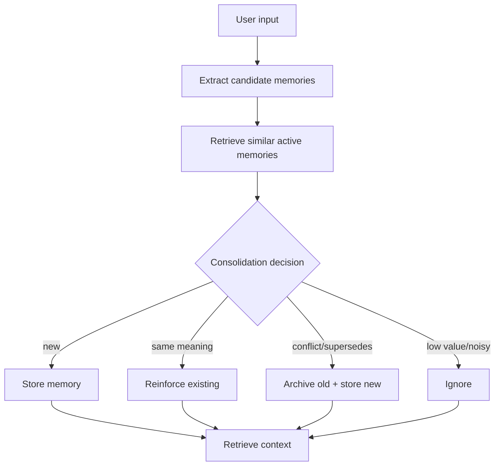

# MemoryAgent Hackathon Hardening Design

Date: 2026-07-05
Project: `E:/CODE/MemoryAgent`
Goal: make the existing MemoryAgent project judge-ready for the hackathon prompt: an agent with persistent memory that autonomously accumulates experience, remembers user preferences, forgets outdated information, and recalls critical memories within limited context windows.

## Context

The repository already contains a working Python package with:

- SQLite-backed persistent storage in `src/memory_agent/core/memory_store.py`.
- Sentence-transformer embeddings in `src/memory_agent/core/embeddings.py`.
- Ebbinghaus-style forgetting and reinforcement in `src/memory_agent/core/forgetting.py`.
- Multi-factor semantic retrieval with MMR diversity in `src/memory_agent/core/retrieval.py`.
- An orchestrator loop in `src/memory_agent/agent/orchestrator.py`.
- Pattern-based preference/fact extraction in `src/memory_agent/agent/decision.py`.
- CLI, MCP server, LLM connector, examples, and tests.

The design does not replace this architecture. It adds the missing hackathon-grade behavior around memory consolidation, stale-memory handling, context-budget-aware recall, and demonstrable cross-session improvement.

The directory is not currently a Git repository, so the design document cannot be committed unless Git is initialized or the project is moved into a repository.

## Recommended approach

Keep the current SQLite + embeddings + forgetting + retrieval architecture. Add focused components:

```text
src/memory_agent/core/
├── consolidation.py      # dedupe, supersede, explicit forgetting decisions
├── context_budget.py     # recall packet packing for limited context windows
└── retrieval.py          # keep scoring/MMR, expose larger candidate pool

src/memory_agent/agent/
└── orchestrator.py       # call consolidation before storage and budget packer after retrieval

tests/
├── test_consolidation.py
├── test_context_budget.py
└── test_agent.py         # extend cross-session behavior tests
```

This is lower risk than a rewrite, preserves existing tests and demos, and directly addresses the hackathon criteria.

## Memory lifecycle

Each extracted candidate memory should produce exactly one consolidation outcome:

1. **Create**: store a new memory when no active memory already represents it.
2. **Reinforce**: boost an existing memory when the candidate matches it and remains valid.
3. **Update**: archive an older active memory and store the new memory when the candidate supersedes it.
4. **Ignore**: drop low-value or noisy candidates.

The orchestrator should route extracted memories through a new `MemoryConsolidator` before writing to storage.



Initial consolidation rules should be deterministic and testable:

- If semantic similarity is above a configurable duplicate threshold, reinforce instead of storing a duplicate.
- If a new preference has the same topic as an active preference but opposite polarity, archive the old memory and store the new one.
- If the user explicitly says to forget a fact or preference, archive the matching active memory.
- Recent explicit user statements win over old active memories.
- Archived memories stay in SQLite for audit/debug flows but are excluded from default recall.

## Memory metadata

No new database table is required for the first pass. Use existing `metadata` and `is_active` fields.

Recommended metadata keys:

```json
{
  "topic": "programming language",
  "polarity": "positive",
  "archival_reason": "superseded",
  "superseded_by": 42,
  "superseded_at": "2026-07-05T00:00:00",
  "consolidation_action": "update"
}
```

Allowed archival reasons:

- `decay`
- `superseded`
- `explicit_user_request`
- `duplicate`
- `low_value`

This keeps the implementation simple while making memory decisions inspectable.

## Context-budget-aware recall

The current `top_k` retrieval behavior should remain available, but the agent loop should use a context packer for prompt construction.

Flow:

1. Retrieve a larger candidate pool, for example `candidate_k=20`.
2. Score candidates with the existing semantic/recency/importance/strength scoring.
3. Apply existing MMR diversity.
4. Estimate each memory's context cost.
5. Reserve budget for the current user input and agent instructions.
6. Pack selected memories by importance-adjusted score density.
7. Return a recall packet with selected and omitted candidates.

Proposed model:

```python
@dataclass
class RecallPacket:
    selected: list[SearchResult]
    omitted: list[SearchResult]
    budget_chars: int
    used_chars: int
    reasons: dict[int, str]
```

The packer should prefer critical memories that are short and highly relevant. It should not blindly include the first `top_k` results when they exceed the available context budget.

## Forgetting and stale information

Existing strength decay should stay. The improvement is to forget semantically stale information, not only old information.

Staleness rules:

- Contradicted preference: archive old active preference as `superseded`.
- Explicit forget request: archive matching memory as `explicit_user_request`.
- Duplicate candidate: reinforce existing memory; optionally archive exact duplicate if one already exists.
- Decay below threshold: archive as `decay`.

Default recall must query active memories only. Historical/debug commands may expose archived memories later, but that is not required for this pass.

## Autonomy and learning loop

The agent should improve from interaction outcomes:

- Recalled and used memories are reinforced.
- Duplicate memories are consolidated rather than accumulated.
- Corrections reduce stale memory influence by superseding or archiving old memories.
- Context budget packing learns operationally by keeping high-value memories visible and omitting low-density memories.

The first implementation should keep feedback deterministic. LLM-based classification can be added later, but is not required for a judge-ready demo.

## Error handling

- If embeddings are unavailable, fall back to keyword search where existing storage supports it.
- If consolidation cannot classify a candidate, default to create rather than destructive archival.
- If context budget is too small for any memory, return an empty `selected` list with omitted reasons.
- If explicit forget matches multiple memories, archive only high-confidence matches and report how many were affected.
- Never hard-delete as part of autonomous forgetting; use archival unless the user explicitly invokes a destructive delete command.

## Tests

Add high-signal behavior tests:

1. **Deduplication**: semantically equivalent preference is reinforced, not duplicated.
2. **Preference update**: old active preference is archived when a new conflicting preference is stated.
3. **Cross-session correction**: session 1 stores preference, session 2 changes it, session 3 recalls only the new preference by default.
4. **Explicit forget**: user command archives matching memory and default recall excludes it.
5. **Context budget**: packer keeps critical short memories and omits lower-score or oversized memories.
6. **Decay archival reason**: decayed memories are archived with `archival_reason=decay`.
7. **No destructive ambiguity**: unclear consolidation defaults to create or ignore, not archival.

Run targeted tests for changed behavior before claiming completion.

## Demo story for hackathon judging

Update the demo to show:

1. Session 1: user says they prefer Python and like concise answers.
2. Session 2: agent recalls those preferences without restating the whole database.
3. Session 3: user says they now prefer Rust over Python.
4. Session 4: agent recalls Rust as current preference and does not surface Python as an active preference.
5. Add low-importance noise memories and show context budget still includes critical preference.
6. Show stats: active memories, archived stale memories, reinforcement counts, context budget usage.

This directly demonstrates persistent memory, autonomous accumulation, user preference memory, timely forgetting, and recall under constrained context.

## Non-goals

- No full rewrite.
- No mandatory external LLM dependency for core behavior.
- No new vector database.
- No hard deletes for autonomous forgetting.
- No broad unrelated refactor.
- No UI work.

## Acceptance criteria

The implementation is complete when:

- Existing behavior still works.
- New consolidation behavior prevents duplicate preference accumulation.
- Changed preferences supersede stale preferences across sessions.
- Explicit forget requests archive matching active memories.
- Context-budget recall returns selected and omitted memories with budget accounting.
- Tests cover the new lifecycle and context-budget behavior.
- A hackathon demo shows memory improving and stale information being forgotten.
